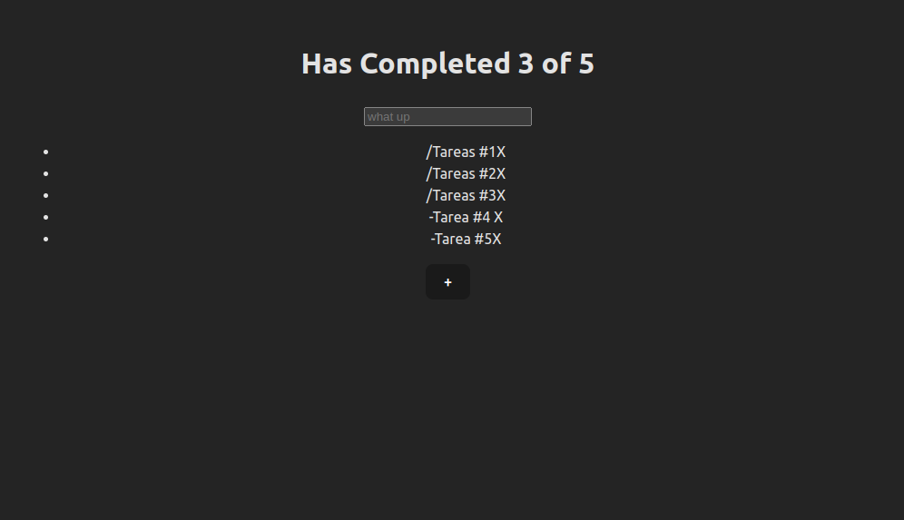

# todo-platzi  with React + Vite

Proyecto del curso  [platzi](https://platzi.com/cursos/react/)

Utilizacion de vite-react useState, useEffect, useContext y localStorage

En la primera fase solo es la funcionalidad

## Fase 1

